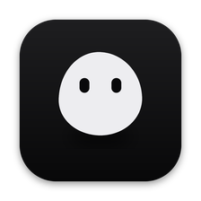

  

<h1 align="center">Kora</h1>

  A Mac app for coding with Claude Code: a local code graph keeps your agents' context small, 
  and a swarm of worker agents takes the legwork off your main agent.

  <a href="https://github.com/agilkatakam/kora/releases/latest/download/Kora-arm64.dmg"><b>Download for Mac</b></a>
  &nbsp;·&nbsp; Apple Silicon &nbsp;·&nbsp; macOS 13.5 or later
  &nbsp;·&nbsp; <a href="https://github.com/agilkatakam/kora/releases">All releases</a>

---

## What it does

- **Chat with your coding agents, per project.** Claude Code (and Codex) in a desktop app, one thread per task.
- **Code graph.** Kora indexes your repository on your Mac and hands agents the exact functions and callers they
  need, so they spend less time (and fewer tokens) searching.
- **Swarm.** Claude leads; cheaper worker agents do the gathering, editing and checking in their own worktrees. Each
  worker runs in a live pane you can watch and steer.
- **Kora blobs.** A second surface (Kora | Code switcher): persistent assistants with their own folder, memory and
  routines, led by Kora the Chief, for work that isn't a code repository.
- **Local.** No Kora account and no analytics. Your code and chats stay on your Mac. Your agents talk to their own
  model providers, as they do without Kora.

## Install

1. [Download Kora](https://github.com/agilkatakam/kora/releases/latest/download/Kora-arm64.dmg) and open the disk
   image.
2. Drag **Kora** onto **Applications**, then open it from Applications.
3. On Kora's first screen, choose **Log in to Claude**. It signs you in through your browser with your Claude plan;
   no Terminal needed. Then open a project folder and ask your first question.

Kora is signed with an Apple Developer ID and notarized by Apple, so it opens like any other Mac app.

## Updates

Kora updates itself. It checks for a new version about once an hour and downloads it in the background. When it's
ready, a **Restart to update** button appears at the bottom of the sidebar; quitting Kora installs it as well. You can
also check by hand in **Settings → About** or **Kora → Check for Updates…**. What changed in each version is on the
[releases page](https://github.com/agilkatakam/kora/releases).

## Report a bug

In Kora, choose **Help → Report a Bug…**. It opens the
[bug form](https://github.com/agilkatakam/kora/issues/new?template=bug_report.yml) with your Kora version and Mac
already filled in.

- Logs help a lot: **Help → Show Logs in Finder** selects `server.log`, which you can drag into the form. Skim it
  first and remove anything private.
- Ideas and wishes go in a [feature request](https://github.com/agilkatakam/kora/issues/new?template=feature_request.yml).
- Questions and tips go in [Discussions](https://github.com/agilkatakam/kora/discussions).
- Security problems: report them privately, as described in [SECURITY.md](SECURITY.md).

## Uninstall

Quit Kora, then in Terminal run `kora uninstall` (add `--purge` to also delete your chats, settings and code graph). Then
drag Kora from Applications to the Trash.

---

This repository holds Kora's releases, update feed and issue tracker; Kora is proprietary software and its source code isn't public. Use of Kora is governed by the [End-User Licence Agreement](EULA.md); © 2026 Koragraph, all rights reserved. The open-source
software it includes is listed, with its licenses, inside the app (`Kora.app/Contents/Resources/THIRD_PARTY_NOTICES.md`).
